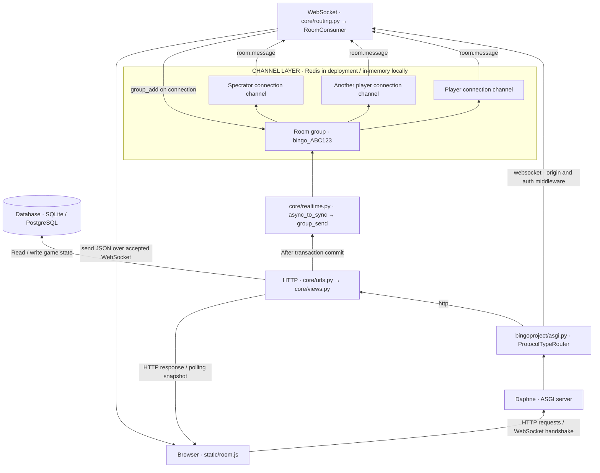

# Prof Bingo

A multiplayer phrase-based Bingo app built with Django, Django Channels, and vanilla JavaScript. Create a room with phrases, share its six-character code, and play together with live scoreboards and Bingo announcements.

## Features

- Create rooms with a title and at least 24 unique phrases.
- Join with a nickname and receive a randomized 5×5 card with a marked free center.
- Mark or unmark squares; complete rows, columns, or diagonals to get Bingo.
- Watch a room as a spectator.
- Receive live player counts, scores, and Bingo announcements through WebSockets.
- Recover missed announcements through database-backed event history and HTTP polling.

## Local setup

From the repository root, create a Python environment and install the declared dependencies:

```bash
python -m venv .venv
source .venv/bin/activate
python -m pip install -r requirements.txt
python manage.py migrate
python manage.py runserver
```

Open <http://127.0.0.1:8000/>. Create a room, add at least 24 unique phrases (one per line), and share the room code. Use another browser or browser profile to try a second player with a separate session.

**Dependency note:** `requirements.txt` currently specifies `Django>=6.1,<7`, while `render.yaml` pins Python `3.12.7`. These declarations must be checked for compatibility and package availability before installation or deployment; the commands above require an environment that can resolve the declared dependencies.

Local defaults use SQLite (`db.sqlite3`) and an in-memory channel layer. Redis is optional for a single local server process.

### Environment configuration

See [`.env.example`](.env.example) for starter values. Settings read process environment variables; the application does not automatically load a `.env` file. To load the provided shell-compatible example:

```bash
cp .env.example .env
# Edit .env for your environment, then load it:
set -a
source .env
set +a
```

- `DEBUG`: defaults to true locally and false on Render.
- `SECRET_KEY`: set a private key for deployment; the built-in fallback is for development.
- `ALLOWED_HOSTS`: comma-separated hostnames. Local defaults include localhost and loopback addresses.
- `CSRF_TRUSTED_ORIGINS`: comma-separated origins, including their scheme, when needed.
- `DATABASE_URL`: database connection URL; defaults to local SQLite when unset.
- `REDIS_URL`: enables the Redis channel layer. Required when `RENDER=true`.
- `PORT`: listening port used by `start.sh`.

On Render, the external hostname supplies default allowed-host and CSRF-origin settings when explicit values are absent. See [`bingoproject/settings.py`](bingoproject/settings.py) for static-file and HTTPS settings.

## Architecture

The diagram below adapts the reference architecture to this repository. Daphne serves the ASGI application, Django handles HTTP requests, Channels manages WebSocket connections, and the channel layer distributes room events.



The HTTP-to-WebSocket upgrade happens between the browser and Daphne. Redis is an internal message distribution layer, not a second protocol upgrade. Each connected browser has its own consumer/channel; the shared `bingo_<ROOM_CODE>` group lets one event reach all connected players and spectators in that room.

Redis allows separate server processes to exchange group messages. The local in-memory backend only shares messages within one process. The database remains the authoritative store for game state and durable Bingo events.

### WebSocket handshake

**1. The browser starts the connection.** In [`static/room.js`](static/room.js), `connectRoomSocket()` builds the room URL and invokes the browser's WebSocket API:

```javascript
const protocol = window.location.protocol === "https:" ? "wss" : "ws";
const url = `${protocol}://${window.location.host}/ws/room/${encodeURIComponent(roomCode)}/`;
// Inside the connection function's try block:
socket = new WebSocket(url);
```

`ws` is used for local HTTP pages; `wss` uses TLS for HTTPS pages. The browser handles the handshake headers automatically.

**2. The ASGI application routes the connection.** [`bingoproject/asgi.py`](bingoproject/asgi.py) separates HTTP and WebSocket traffic:

```python
application = ProtocolTypeRouter(
    {
        "http": django_asgi_app,
        "websocket": AllowedHostsOriginValidator(
            AuthMiddlewareStack(URLRouter(websocket_urlpatterns))
        ),
    }
)
```

`AllowedHostsOriginValidator` checks the request origin. `AuthMiddlewareStack` provides session/authentication context; it does not itself require a logged-in user. [`core/routing.py`](core/routing.py) maps the six-character room code to the consumer:

```python
websocket_urlpatterns = [
    re_path(r"ws/room/(?P<room_code>[A-Za-z0-9]{6})/$", consumers.RoomConsumer.as_asgi()),
]
```

**3. The consumer accepts a valid room connection.** In [`core/consumers.py`](core/consumers.py):

```python
async def connect(self):
    raw_code = self.scope["url_route"]["kwargs"]["room_code"]
    self.room_code = normalize_code(raw_code)
    self.group_name = room_group_name(self.room_code)

    room = await self.get_room(self.room_code)
    if not room:
        await self.close()
        return

    await self.channel_layer.group_add(self.group_name, self.channel_name)
    await self.accept()
```

`accept()` tells the ASGI server to complete the handshake. For a conventional HTTP/1.1 WebSocket handshake, the successful response is `101 Switching Protocols`. The server then sends an initial `score_update` containing the room's scoreboard.

The consumer checks that the room exists; it does not require player membership, which allows spectators to connect. Card mutations separately require the player's session in the HTTP view.

**4. The browser confirms the connection is healthy.** The browser's `open` event indicates the handshake succeeded. This app waits for a server message before marking the connection live:

```javascript
socket.addEventListener("message", (event) => {
  if (roomSocket !== socket) return;
  socketHealthy = true;
  reconnectAttempts = 0;
  setConnectionStatus("Live · connected", "live");
  scheduleHeartbeat(socket, roomCode);
  handleRoomSocketMessage(event);
});
```

### From a marked square to a live update

1. The browser sends an HTTP POST to `/room/<code>/mark/<square_id>/`.
2. `toggle_mark()` verifies the player's session and card, updates the square inside a transaction, and checks completed lines.
3. If the mark completes a new line, the view saves a `BingoEvent` in the database.
4. `transaction.on_commit()` publishes the score update and any new Bingo event through `core/realtime.py`.
5. The synchronous broadcast helper uses `async_to_sync()` to call asynchronous `channel_layer.group_send()`, with a two-second timeout.
6. Channels dispatches the internal `room.message` event to each consumer's `room_message()` method.
7. The consumer sends JSON over its WebSocket, and `room.js` updates the scoreboard or displays an announcement.

Player joins similarly publish `player_joined` and `score_update` messages. The application uses HTTP for game mutations and WebSockets for server notifications; incoming WebSocket messages currently handle only the application's ping/pong heartbeat.

### Messages and recovery

- `score_update`: the current `players` scoreboard data; also sent immediately after connecting.
- `player_joined`: the joining player's nickname and updated `player_count`.
- `bingo`: an announcement with `event_id`, `player_id`, and `player`.
- `ping` / `pong`: application-level JSON heartbeat messages used to detect broken connections.

The browser reconnects with exponential backoff and jitter, capped at 30 seconds. It polls `/room/<code>/scores/` every 15 seconds while the socket is healthy and every 5 seconds when disconnected. Immediate checks also occur during connection and recovery.

Persisted Bingo events and an event cursor let clients retrieve missed announcements. Client-side event deduplication prevents repeated announcements. Broadcast failures are logged without undoing committed game changes, so polling can recover the state even when Redis is unavailable.

## Project layout

```text
bingoproject/
  settings.py       Environment, database, channel layer, static files
  asgi.py           HTTP and WebSocket protocol routing
  urls.py           Top-level Django URLs
core/
  models.py         Rooms, phrases, players, cards, squares, Bingo events
  forms.py          Room, phrase, room-code, and nickname validation
  services.py       Card generation, winning lines, scoreboard calculations
  views.py          HTTP pages, marking squares, score/event polling
  urls.py           HTTP routes
  routing.py        WebSocket URL routes
  consumers.py      WebSocket lifecycle and message delivery
  realtime.py       Room-group broadcasts
  templates/        Server-rendered pages and partials
  tests.py          Django and WebSocket tests
static/
  room.js           Card interactions, live updates, reconnect and recovery
  index.js          Home-page behavior
tests/
  room.test.cjs     JavaScript connection and recovery tests
build.sh            Dependency installation, static collection, migrations
start.sh            Static collection and Daphne startup
render.yaml         Render web service, PostgreSQL, and Redis configuration
```

## Checks and tests

With Python dependencies installed:

```bash
python manage.py check
python manage.py test
```

With Node.js installed (the JavaScript tests use its built-in test runner):

```bash
node --test tests/room.test.cjs
```

The existing tests cover game mutations, durable event recovery, broadcast failures, WebSocket messages, and browser reconnection behavior.

## Deployment

[`render.yaml`](render.yaml) defines a Render web service, PostgreSQL database, and Redis Key Value service. Check the dependency/runtime declarations noted above before using the blueprint.

- Build command: `./build.sh` installs dependencies, collects static files, and applies migrations.
- Start command: `./start.sh` collects static files and runs Daphne against `bingoproject.asgi:application` on `PORT`.
- Health endpoint: `/health/` returns `ok`; it is a basic HTTP check, not a database or Redis readiness probe.
- The blueprint supplies `DATABASE_URL`, `REDIS_URL`, and a generated `SECRET_KEY`.

For another hosting environment, use the same ASGI entry point, provide the environment variables, apply migrations, and collect static files. Route WebSocket upgrade requests through any reverse proxy to Daphne. Use a shared Redis channel layer when running multiple server processes.
